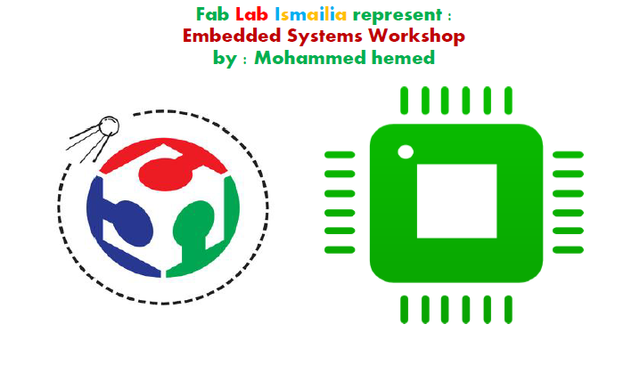

### Material used in Embedded Workshop : 

**- Embedded Systems introduction**

**- C for Embedded Systems :**
- variables & constatnts
- flowcharts
- C contol statements 
- functions  
- pre-processor 
- embedded C
- Bit manipulation 

**- How to make a configuartion header file for uC** 

**- How to create your own library** 

**- GPIOs** 
- I/O interfacing : leds - switches - sevenSegment- Motors (Dc - Servo)  

**- Interrupt : External interrupts** 

**- ADC : Read different transducers (sensors)** 

**- UART : talk to and listen from uC**  

### Recommended books : 

- Simply AVR -> Abdallah Ali
- The AVR microcontroller & Embedded Systems using Assembly & c -- > Mazidi 
- PIC microcontroller -- > Milan Verle

### Recommended sites : 

https://www.sparkfun.com

http://maxembedded.com

https://www.tutorialspoint.com/cprogramming 

https://stackoverflow.com

https://www.quora.com 

https://www.lucidchart.com 

### Code and simulation for each topic :

- DC motor interfacing 
- Servo Motor interfacing 
- display character on led bar  
- Debuncing 
- Seven segment interfacing 
- embedded C concepts and practise on led bar 
- External interrupt 
- Read variable resistor via ADC 
- UART (computer talk to and listen from uC) 

### Libraries made from zero : 

- external interrupt  
- embeddedC
- motors              
- seven segment 

### Hardware Required : 

- uC = ATMEGA32 
- programmer = USBASP 
- leds - resistors - push buttons - led bar - seven segment 
- motors (DC - Servo)
- DC motor driver : l293d | l298d  
- usb to uart converter 
- blueutooth module
- breadboard - jumbers - 5K varialble resistor 

### Software Required : 

- Atmel Studio 
- proteus 
- sublime 
- exterme burner | avrdude 
- putty

### Final project : 

- contol a device via smart phone | using PC 

